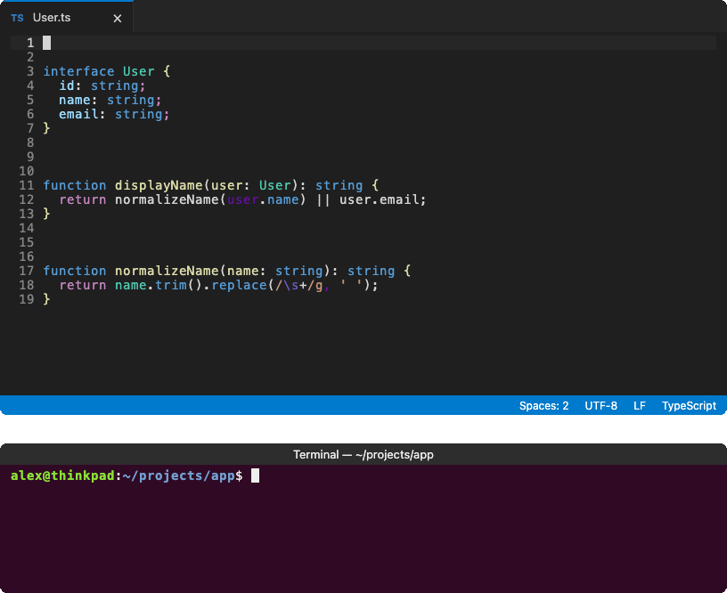

# code-divider

[](https://www.npmjs.com/package/code-divider)
[](https://www.npmjs.com/package/code-divider)
[](https://www.npmjs.com/package/code-divider)
[](https://github.com/seanpmaxwell/code-divider/actions/workflows/ci.yml)

**Give your code a little breathing room.**

`code-divider` turns simple comment markers into tidy, centered headers. No counting `=` signs. No lining things up by hand.

Use it from the command line, run it automatically when you save, or call it from your own code.

## 👀 Preview



## 🧭 Table of contents

- [👀 Preview](#-preview)
- [🚀 Quick start](#-quick-start)
- [📌 Markers](#-markers)
- [💻 Command-line options](#-command-line-options)
- [💾 Run on save](#-run-on-save)
- [🧩 Divider anatomy](#-divider-anatomy)
- [🔧 Configuration](#-configuration)
  - [Create a config file](#create-a-config-file)
  - [How config files are found](#how-config-files-are-found)
  - [Shared settings](#shared-settings)
  - [Language-specific settings](#language-specific-settings)
  - [Built-in languages](#built-in-languages)
  - [Filtering files](#filtering-files)
    - [Default exclusions](#default-exclusions)
    - [Pattern cheat sheet](#pattern-cheat-sheet)
- [💻 Programmatic use](#-programmatic-use)
- [📄 License](#-license)

## 🚀 Quick start

Add a marker on its own line in a source file:

```js
// @reg utilities

// @sec helper functions
```

Then run:

```bash
npx code-divider --path ./src
```

Your markers are replaced in place with formatted headers. That’s it!

You can target a file or a folder. Folders are searched recursively, using the configured file filters.

Want to look before you leap? Add `--dry-run` to list the files that would change without touching them:

```bash
npx code-divider --path ./src --dry-run
```

## 📌 Markers

There are two kinds of dividers:

| Marker          | Creates                               | Handy for                                           |
| --------------- | ------------------------------------- | --------------------------------------------------- |
| `// @reg Label` | A three-line boxed **region** header. | Major groups, such as imports, types, or functions. |
| `// @sec Label` | A single-line **section** header.     | Smaller groups within a region.                     |

Use your language’s comment syntax:

```js
// @sec helper functions
```

```python
# @sec helper functions
```

```css
/* @sec helper functions */
```

By default, region labels become **UPPERCASE** and section labels become **Capitalized Words**. You can customize both in [Configuration](#-configuration).

Built-in support includes JavaScript, TypeScript, Java, CSS, SCSS, C, C++, Go, Rust, PHP, Ruby, Python, Bash, and SQL. You can add more languages through configuration.

## 💻 Command-line options

```bash
npx code-divider [options]
```

With no options, `code-divider` processes the current directory.

| Option                  | What it does                                                                                                                                              |
| ----------------------- | --------------------------------------------------------------------------------------------------------------------------------------------------------- |
| `-p`, `--path <path>`   | Process a file or directory. Defaults to the current directory.                                                                                           |
| `-c`, `--config <file>` | Use a specific config file. Its settings override the built-in defaults.                                                                                  |
| `-d`, `--dry-run`       | List the files that would change without writing anything.                                                                                                |
| `--check`               | Like `--dry-run`, but exit with code `1` if any file would change. Useful for CI and pre-commit hooks.                                                    |
| `-i`, `--init [dir]`    | Create a default `code-divider.config.json` in the given directory, or the current directory if omitted. Runs on its own without processing source files. |
| `-h`, `--help`          | Show help.                                                                                                                                                |
| `-v`, `--version`       | Show the version.                                                                                                                                         |

A few examples:

```bash
# Process the current directory
npx code-divider

# Process one file
npx code-divider --path ./src/index.ts

# Check for changes in CI without modifying files
npx code-divider --check

# Use a specific config file
npx code-divider --config ./custom.config.json
```

## 💾 Run on save

This is my favorite way to use `code-divider`: write a marker, hit save, and let your editor handle the rest.

If your editor supports running commands on save, configure it to run `npx code-divider`.

For VS Code, install the [Run on Save](https://github.com/emeraldwalk/vscode-runonsave) extension and add this setting to your `settings.json`:

```json
{
  "emeraldwalk.runonsave": {
    "commands": [
      {
        "match": "\\.(css|js|jsx|ts|tsx)$",
        "cmd": "npx code-divider"
      }
    ]
  }
}
```

This runs the command whenever you save a file with one of the listed extensions. Adjust `match` to include the file types you work with.

The command processes its working directory using your file filters—not just the file you saved.

## 🧩 Divider anatomy

Here’s a section divider, shortened for readability:

```js
// ============== My Section ============== //
```

These are the names used throughout the configuration:

| Term                 | Meaning                                                                            |
| -------------------- | ---------------------------------------------------------------------------------- |
| **Marker**           | The token that requests a divider: `@reg` or `@sec`.                               |
| **Comment**          | The comment syntax used to write the marker, such as `//`, `#`, or `/* ... */`.    |
| **Label**            | The title after the marker, such as `My Section`.                                  |
| **Filler character** | The repeated character that fills the available space: `=` in this example.        |
| **Bookends**         | The strings at the start and end of each generated line: `"// "` and `" //"` here. |

## 🔧 Configuration

The defaults work out of the box. Add a config file only when you want to make the dividers your own.

### Create a config file

Start with a file containing all the default settings:

```bash
npx code-divider --init
```

This creates `code-divider.config.json` in the current directory. It won’t overwrite an existing file.

To create it somewhere else:

```bash
npx code-divider --init ./packages/app
```

You can also write a smaller config by hand. You only need to include the settings you want to change.

### How config files are found

Unless you pass `--config <file>`, `code-divider` checks these locations in order:

1. The target directory, or the containing directory if the target is a file.
2. The directory the command is run from.

The first config found wins. These config files are **not merged together**.

Settings in the selected config override the built-in defaults. Anything you leave out keeps its default value. If no config is found, the built-in defaults are used.

### Shared settings

The `All` key contains settings shared by every language:

| Setting              | What it controls                                  | Default        |
| -------------------- | ------------------------------------------------- | -------------- |
| `CharacterLimit`     | The column that generated header lines extend to. | `79`           |
| `FillerCharacter`    | The character used to fill the header lines.      | `"="`          |
| `RegionLabelFormat`  | How region labels are capitalized.                | `"uppercase"`  |
| `SectionLabelFormat` | How section labels are capitalized.               | `"capitalize"` |

Both label-format settings accept:

| Value          | Example                               |
| -------------- | ------------------------------------- |
| `"uppercase"`  | `my cool section` → `MY COOL SECTION` |
| `"lowercase"`  | `My Cool Section` → `my cool section` |
| `"capitalize"` | `my COOL section` → `My Cool Section` |
| `"none"`       | Leave the label exactly as written.   |

`"capitalize"` uppercases the first letter of each word and lowercases the rest.

Words that start or end with a non-alphanumeric character are left unchanged under every format. That keeps labels containing things like `@decorator` or `foo()` intact.

### Language-specific settings

Want Python headers to look different from Java headers? Give each language its own settings.

Other than `All` and `filter`, top-level config keys are language names. Use a built-in key to customize that language, or a new key to add your own.

| Setting              | What it controls                                                                                                                                                                       |
| -------------------- | -------------------------------------------------------------------------------------------------------------------------------------------------------------------------------------- |
| `Extensions`         | File extensions to match, without the leading dot. For example, `["py"]`.                                                                                                              |
| `Comment`            | A `[start, end]` pair describing the comment syntax used for markers. Use `""` as the end for line comments.                                                                           |
| `Bookends`           | Optional `[start, end]` strings for generated header lines. Defaults to `Comment`; for line comments, the opener is mirrored on the right. For example, `"# "` becomes `["# ", " #"]`. |
| `CharacterLimit`     | Override `All.CharacterLimit` for this language.                                                                                                                                       |
| `FillerCharacter`    | Override `All.FillerCharacter` for this language.                                                                                                                                      |
| `RegionLabelFormat`  | Override `All.RegionLabelFormat` for this language.                                                                                                                                    |
| `SectionLabelFormat` | Override `All.SectionLabelFormat` for this language.                                                                                                                                   |

For example:

```json
{
  "All": {
    "CharacterLimit": 100,
    "FillerCharacter": "-"
  },
  "Java": {
    "Bookends": ["/* ", " */"]
  },
  "Python": {
    "Extensions": ["py"],
    "Comment": ["# ", ""]
  }
}
```

This configuration:

- Sets the shared header width to `100` and uses `-` as the filler.
- Wraps generated Java headers in block comments.
- Matches Python files with the `.py` extension and reads markers written as `# @reg Label` or `# @sec Label`.

With these settings, `# @reg Label` in a `.py` file becomes a boxed **LABEL** header with rule lines filled with `-` up to column `100`.

### Built-in languages

These are the language keys, file extensions, and comment styles available by default. The marker examples use `@reg`, but `@sec` uses the same syntax.

| Config key   | File extensions               | Marker example     | Generated bookends |
| ------------ | ----------------------------- | ------------------ | ------------------ |
| `JavaScript` | `.js .jsx .ts .tsx .mjs .cjs` | `// @reg Label`    | `"// "` … `" //"`  |
| `Java`       | `.java`                       | `// @reg Label`    | `"// "` … `" //"`  |
| `Css`        | `.css .scss`                  | `/* @reg Label */` | `"/* "` … `" */"`  |
| `C`          | `.c .h`                       | `// @reg Label`    | `"// "` … `" //"`  |
| `Cpp`        | `.cpp .cc .cxx .hpp .hh .hxx` | `// @reg Label`    | `"// "` … `" //"`  |
| `Go`         | `.go`                         | `// @reg Label`    | `"// "` … `" //"`  |
| `Rust`       | `.rs`                         | `// @reg Label`    | `"// "` … `" //"`  |
| `Php`        | `.php`                        | `// @reg Label`    | `"// "` … `" //"`  |
| `Ruby`       | `.rb`                         | `# @reg Label`     | `"# "` … `" #"`    |
| `Python`     | `.py .pyi .pyw`               | `# @reg Label`     | `"# "` … `" #"`    |
| `Bash`       | `.sh`                         | `# @reg Label`     | `"# "` … `" #"`    |
| `Sql`        | `.sql`                        | `-- @reg Label`    | `"-- "` … `" --"`  |

### Filtering files

Use the top-level `filter` key to choose which files get processed.

Patterns work like `include` and `exclude` in a [`tsconfig.json`](https://www.typescriptlang.org/tsconfig/#include). They are relative to the folder being processed.

| Setting   | What it does                                                                                              |
| --------- | --------------------------------------------------------------------------------------------------------- |
| `include` | Process only matching files. Defaults to `[]`, which uses the default recursive search.                   |
| `exclude` | Skip matching files and folders. Your list replaces the built-in exclusions. Use `[]` to exclude nothing. |

File filters select candidates; files still need to match a configured language extension.

#### Default exclusions

Out of the box, `code-divider` skips:

- **At any depth:** `node_modules`, `.vscode`, `.idea`, `.claude`, and files ending in `.log` or `.json`.
- **At the top level:** `bin`, `lib`, and `dist`.

Here’s the default filter configuration:

```json
{
  "filter": {
    "include": [],
    "exclude": [
      "bin",
      "lib",
      "dist",
      "**/node_modules",
      "**/*.log",
      "**/*.json",
      "**/.vscode",
      "**/.idea",
      "**/.claude"
    ]
  }
}
```

#### Pattern cheat sheet

| Pattern                        | Meaning                                                      |
| ------------------------------ | ------------------------------------------------------------ |
| `*`                            | Zero or more characters within a single file or folder name. |
| `?`                            | One character within a name.                                 |
| `**`                           | Any number of folder levels. Must be a whole path segment.   |
| `src` in `include`             | Recursively include `src`, just like `src/**/*`.             |
| `node_modules` in `exclude`    | Skip the top-level `node_modules` folder.                    |
| `**/node_modules` in `exclude` | Skip `node_modules` folders at any depth.                    |

A few rules worth knowing:

- **Exclusions always win.** Excluded folders are not searched.
- In `include`, a final segment with no `.`, `*`, or `?` is treated as a directory and expanded recursively.
- Include wildcards skip names starting with `.` unless the dot is explicitly matched. For example, use `".github/**/*"` to search inside `.github`.
- Include patterns cannot end with `**`. Use `"src/**/*"` or simply `"src"` instead.
- `!` negation and `[abc]` character classes are not supported.

For example, to process `src` while skipping dependencies and test files:

```json
{
  "filter": {
    "include": ["src"],
    "exclude": ["**/node_modules", "**/*.test.ts"]
  }
}
```

**Remember:** this `exclude` list replaces the defaults—it does not add to them. Include any default exclusions you want to keep.

## 💻 Programmatic use

Prefer to wire `code-divider` into your own tooling? Import it directly:

```js
import insertdividers from 'code-divider';

const updatedFiles = await insertdividers('src');
```

Or pass options:

```js
const filesThatWouldChange = await insertdividers('src', {
  cwd: '/path/to/project',
  configFilePath: 'custom.config.json',
  isDryRun: true,
});
```

The signature is:

```js
insertdividers(targetPath, options?)
```

`targetPath` can be a file or directory. Relative paths are resolved against `options.cwd`.

All options are optional:

| Option           | What it does                                                                                                  | Default         |
| ---------------- | ------------------------------------------------------------------------------------------------------------- | --------------- |
| `cwd`            | Base directory for resolving relative paths.                                                                  | `process.cwd()` |
| `configFilePath` | Use a specific config file. If empty, check the target directory, then `cwd`, then use the built-in defaults. | `''`            |
| `isDryRun`       | Return the files that would change without writing them.                                                      | `false`         |
| `logger`         | Handle messages with an object exposing `info` and `warn` methods, such as `console`.                         | Console output  |
| `silent`         | Suppress all messages. Takes priority over `logger`.                                                          | `false`         |

The logger receives:

- `info` messages, such as which config file is being used.
- `warn` messages, such as a marker with no label.

The function returns a promise that resolves to the list of updated files—or, with `isDryRun: true`, the files that would be updated.

## 📄 License

MIT
